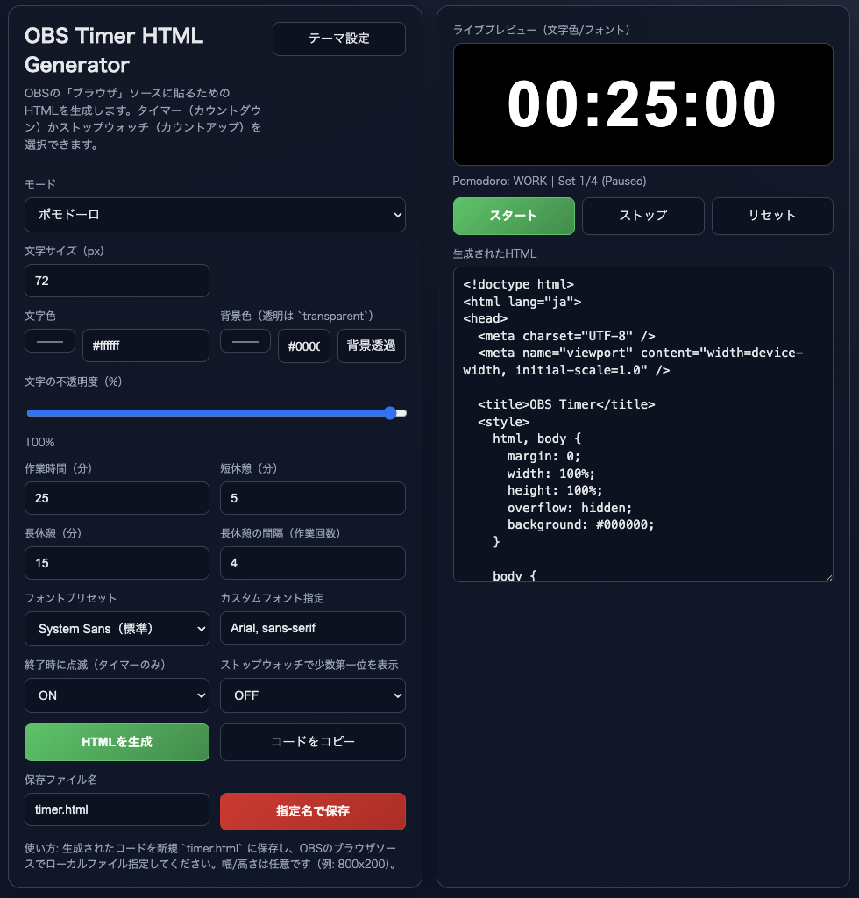
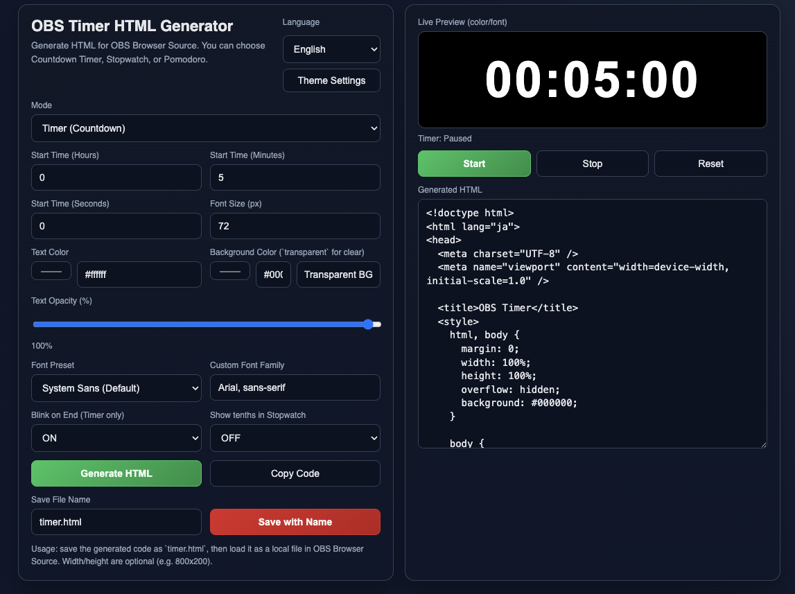

# OBS Timer HTML Generator

<p align="center">
  <a href="https://darujava.github.io/OBS-timerKit/">
    
  </a>
  
  
</p>



A professional HTML timer generator designed for streamers.

Create customizable, ready-to-use HTML timer overlays for:

- Timer
- Stopwatch
- Pomodoro Timer

---

## 🚀 Live Demo

👉 **https://darujava.github.io/OBS-timerKit/**

Launch the generator directly in your browser — no installation required.

---

## ✨ Features

- Standalone HTML file generation
- Custom background color
- Custom text color
- Adjustable timer duration
- Pomodoro interval configuration
- Japanese / English language support
- Works as Media Source
- Works as Browser Source
- Lightweight and fast

---

## 🌎 English Interface



The interface is fully available in English for international streamers.

---

## 📺 Supported Software

- OBS Studio
- Streamlabs Desktop

---

## 🛠 Usage

### Method 1 — Local HTML File

1. Open the Live Demo  
2. Configure your timer  
3. Download the generated HTML file  
4. In OBS:
   - Add **Media Source**
   - Enable **Local File**
   - Select the generated file  

---

### Method 2 — Browser Source

1. Open the Live Demo  
2. Configure your timer  
3. In OBS:
   - Add **Browser Source**
   - Set width / height (example: 800×200)
   - Load the file or URL  

---

## 🎨 Customization Options

- Timer duration
- Pomodoro work / break intervals
- Background color
- Text color
- Language (JP / EN)

---

## 📦 Project Structure

```
index.html
script.js
style.css
Screenshot.png
Screenshot-english.png
```

---

## 📄 License

MIT License

You are free to use, modify, and distribute this project.

---

## ⭐ Support

If you find this project useful, consider giving it a star.
