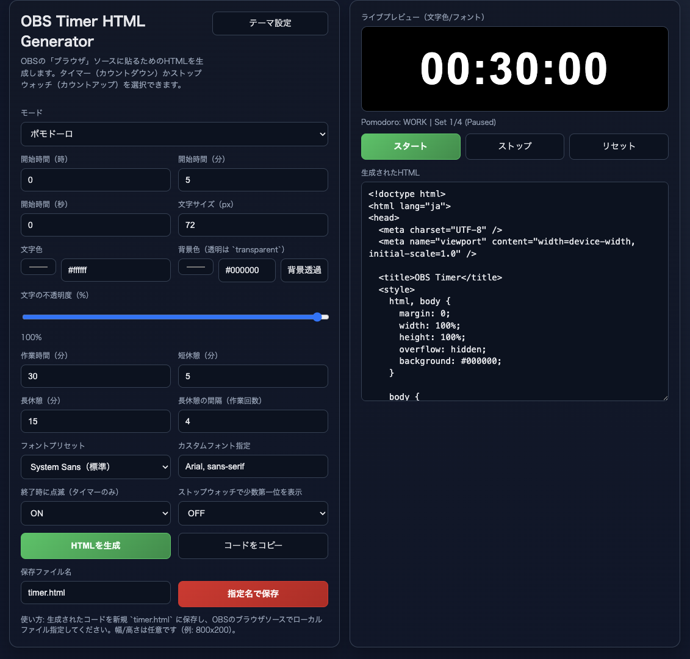

# OBS Timer HTML Generator

A web-based generator for creating customizable HTML timers for streaming.

This tool allows you to generate ready-to-use HTML files for:

- Timer
- Stopwatch
- Pomodoro Timer

🌐 Live Site:  
https://darujava.github.io/OBS-timer/

---

## 🔧 Features

- Generate standalone HTML files
- Custom background color
- Custom text color
- Adjustable timer settings
- Pomodoro interval configuration
- Works as Media Source
- Works as Browser Source

---

## 📺 Supported Software

- OBS Studio
- Streamlabs Desktop

---

## 🚀 How to Use

### Method 1: Use Generated HTML (Local File)

1. Open the generator site  
2. Configure your timer  
3. Download the generated HTML file  
4. In OBS:
   - Add **Media Source**
   - Enable "Local File"
   - Select the generated HTML file

---

### Method 2: Use as Browser Source

1. Open the GitHub Pages site  
2. Configure your timer  
3. Use generated file or URL  
4. In OBS:
   - Add **Browser Source**
   - Set width / height (example: 800x600)
   - Load the file

---

## 🎨 Customization

You can customize:

- Timer duration
- Background color
- Text color
- Pomodoro intervals

---

## 📄 License

MIT License

You are free to use, modify, and distribute this project.

---

## ⭐ Support

If you find this project useful, consider giving it a star.
